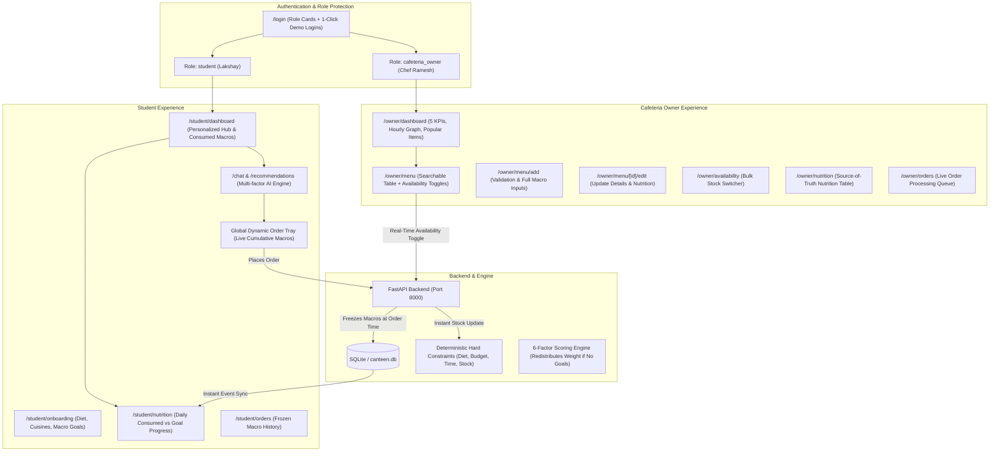

# Walkthrough: BiteBuddy — Multi-Role Food-Tech Platform (Student & Cafeteria Owner)

**BiteBuddy** (*"Good Food. Smarter Choices."*) has been upgraded into a production-ready, full-stack multi-role application supporting two distinct personas:
1. **Student**: Dietary onboarding, personalized dashboard, real-time daily macro tracking against goals, dynamic multi-item order tray with live cumulative nutrition, explainable AI recommendations, and detailed nutritional facts per serving.
2. **Cafeteria Owner**: Business KPI metrics, hourly order rush graph, searchable menu inventory table, add/edit/delete dishes with nutritional values, real-time stock availability toggles, and live kitchen order queue.

---

## 🏗️ Architectural Overview & Data Flow



---

## 🌟 Key Features Implemented

### 1. Authentication & Role-Based Access Control
- **Landing & Login** (`/login`):
  - Two prominent role selection cards: **Student** vs **Cafeteria Owner**.
  - **1-Click Demo Logins**:
    - **Student**: *Lakshay Sharma* (`student_lakshay`, `student@example.com`)
    - **Cafeteria Owner**: *Chef Ramesh* (`owner_ramesh`, `owner@canteen.edu`)
  - Full signup & credentials login support with role selection and form validation.
  - Client-side route protection in [AuthContext.tsx](file:///Users/lakshay/Food%20Recomendation/frontend/src/context/AuthContext.tsx): prevents students from accessing `/owner/*` and owners from accessing `/student/*`.
  - Global navbar adapts seamlessly, showing student links, active order badge, and a **"Switch to Owner/Student"** quick-toggle button.

---

### 2. Student Experience

#### A. Dietary Onboarding Wizard (`/student/onboarding`)
- 5-step wizard capturing:
  1. **Dietary Preferences**: Vegetarian, Vegan, Jain, Eggitarian, Halal, Gluten-Free, Dairy-Free, Nut-Free.
  2. **Taste Profile**: Spicy, Mild, Sweet, Crispy, Light, Filling.
  3. **Cuisines**: North Indian, South Indian, Chinese, Street Food, Continental, Beverages.
  4. **Budget & Time**: Max budget slider (₹30 – ₹200) and max prep time (5 – 30 min).
  5. **Nutrition Goals (Optional)**: Calories (kcal), Protein (g), Carbs (g), Fat (g). Students can skip or enable anytime.

#### B. Student Dashboard (`/student/dashboard`)
- Greet student with active dietary tags and budget caps.
- **Today's Consumed Nutrition Card**: Real-time progress bars for Calories, Protein, Carbs, and Fat comparing actual consumed food vs target goals.
- Quick action cards: *Ask AI Assistant*, *Browse Full Menu*, *Nutrition Tracker*, *Order History*.
- Personalized *Today's Recommended Meal* preview.

#### C. Daily Consumed Nutrition Tracking (`/student/nutrition`)
- **Strict Data Integrity**: Consumed macros are derived **only from placed orders / consumed items**. Unselected recommendations never artificially inflate daily intake.
- Visual progress bars with consumed / goal metrics and percentage indicators.
- **"Today's Consumed Meals"** chronological ledger listing every ordered item, timestamp, quantity, and frozen nutritional contribution.
- Medical disclaimer: *"Approx. nutrition per serving. For general wellness guidance only; not medical advice."*

#### D. Dynamic Multi-Item Order Tray (`OrderDrawer.tsx`)
- Accessible from any page via floating trigger or navbar cart badge.
- **Live Cumulative Calculations**:
  - Automatically sums price (₹), total calories (kcal), protein (g), carbs (g), and fat (g) across multiple items and quantities.
- Quantity increment (`+`), decrement (`-`), and remove item controls.
- **Confirm Order** button:
  - Submits to `POST /orders` with items and customer name.
  - Backend freezes current item price and macros onto `OrderItem` records.
  - Automatically emits a window event (`canteen_order_placed`) that triggers immediate re-fetching in all open student views.

#### E. Detailed Food Item Page (`/menu/[id]`)
- High-resolution dish photography, price, availability status, preparation time, and category badges.
- **Interactive Nutrition Facts Card**: Serving size, Calories, Protein, Carbohydrates, Total Fat, Dietary Fiber, Sugars, and Sodium.
- **"How this fits your goals" Box**: Analyzes item macros against student targets (e.g. *"Covers 23% of your daily protein target"*).
- Allergen warnings: Eggs, Dairy, Gluten, Nuts.

#### F. AI Chat & Recommendations (`/chat`, `/recommendations`)
- Conversational natural-language interface with quick suggestion chips.
- Returns ranked dishes and combos with match percentage badges (e.g., `94% Match`), dietary fit explanations, prep time, and direct `Add to Order` buttons.

---

### 3. Cafeteria Owner Experience

#### A. Owner Dashboard (`/owner/dashboard`)
- **5 High-Level KPI Cards**:
  1. *Total Menu Items*: 34 items
  2. *Available Now*: Active in-stock count
  3. *Today's Orders*: Total orders placed
  4. *Avg Prep Time*: 8.4 mins
  5. *Today's Revenue*: Cumulative ₹ earnings
- **Hourly Order Rush Chart**: Interactive SVG visual tracking peak breakfast, lunch, and evening snack rush hours.
- **Most Popular Items Table**: Top-selling dishes with order count and revenue.
- **Availability Summary**: Quick progress bar showing menu in-stock percentage.

#### B. Searchable Menu Management (`/owner/menu`)
- Real-time instant search by dish name or tag.
- Category filter tabs (`All`, `Main Course`, `Snacks`, `Beverages`, `Breakfast`).
- Full data columns: Thumbnail, Dish Name, Category, Price (₹), Prep Time, Nutrition summary (kcal / P / C / F), and Status.
- **1-Click Live Availability Toggle**: Changes stock status instantly without page reload via `PUT /owner/menu/{id}/availability` and `PUT /menu/{id}/availability`.
- Quick action buttons: `Edit`, `Delete`, and top `+ Add Food Item` CTA.

#### C. Add Food Item (`/owner/menu/add`)
- Comprehensive form with non-negative client and server validations:
  - Dish Name, Category, Price (min ₹1), Prep Time (min 1 min), Description, Image URL.
  - **Nutritional Fields**: Calories (kcal), Protein (g), Carbohydrates (g), Fat (g), Fiber (g), Sugar (g), Sodium (mg).
  - **Dietary & Allergen Checkboxes**: Vegetarian, Vegan, Contains Dairy, Contains Egg, Contains Gluten, Contains Nuts.

#### D. Bulk Availability Grid (`/owner/availability`)
- Grid of all cafeteria items with instant green/rose toggle switches for high-rush kitchen hours.

#### E. Nutrition Source-of-Truth Table (`/owner/nutrition`)
- Centralized view of all cafeteria food items with inline macro editing.
- Clear indication that updating a dish's macros applies to future orders, while historical student orders maintain their frozen nutritional values.

#### F. Live Kitchen Order Queue (`/owner/orders`)
- Kitchen display system listing active orders, customer names, timestamp, ordered items with quantities, total amount, and status transitions (`pending` → `preparing` → `ready` → `completed`).

---

## 🧪 Verification & Test Results

### 1. Backend Pytest Suite
All 12 backend integration and unit test suites pass in **0.37 seconds**:

```bash
.venv/bin/pytest backend/tests/test_api.py -v
```

| Test Case | Scope / Scenario | Result |
| :--- | :--- | :---: |
| `test_health` | Backend root & health endpoints | ✅ Passed |
| `test_get_menu` | Retrieval of enriched 34-item menu | ✅ Passed |
| `test_put_menu_availability` | Availability toggle API compatibility | ✅ Passed |
| `test_post_recommend_direct` | Multi-factor recommendation engine | ✅ Passed |
| `test_chat_edge_case_no_budget` | Graceful fallback when budget unspecified | ✅ Passed |
| `test_chat_edge_case_contradiction_vegan_paneer` | Resolving contradictory requests (vegan vs paneer) | ✅ Passed |
| `test_chat_edge_case_negative_budget` | Rejection/sanitization of invalid inputs | ✅ Passed |
| `test_chat_full_flow_and_conversational_refinement` | Multi-turn conversational preference refinement | ✅ Passed |
| `test_multi_role_auth` | Student & Owner demo login + token generation | ✅ Passed |
| `test_orders_dynamic_macros_and_frozen_integrity` | Order placement, dynamic macro summation, and historical frozen integrity | ✅ Passed |
| `test_owner_menu_crud_and_stats` | Owner KPIs, menu creation with macros, and delete | ✅ Passed |
| `test_section_28_demo_scenario` | End-to-end Section 28 verification scenario | ✅ Passed |

### 2. Frontend Next.js Build
All 22 static and dynamic routes compiled cleanly:

```bash
npm run build
```
```
Route (app)                              Size     First Load JS
┌ ○ /                                    3.55 kB         100 kB
├ ○ /_not-found                          875 B          88.2 kB
├ ○ /admin                               4.17 kB         101 kB
├ ○ /chat                                8.14 kB         105 kB
├ ○ /how-it-works                        2.43 kB        98.8 kB
├ ○ /login                               5.13 kB         102 kB
├ ○ /menu                                7.82 kB         104 kB
├ ƒ /menu/[id]                           7.34 kB         104 kB
├ ○ /owner/availability                  4.74 kB         101 kB
├ ○ /owner/dashboard                     3.78 kB         100 kB
├ ○ /owner/menu                          5.69 kB         102 kB
├ ƒ /owner/menu/[id]/edit                3.69 kB         100 kB
├ ○ /owner/menu/add                      4.01 kB         100 kB
├ ○ /owner/nutrition                     4.83 kB         101 kB
├ ○ /owner/orders                        1.79 kB        98.2 kB
├ ○ /preferences                         3.63 kB        90.9 kB
├ ○ /recommendations                     5.2 kB          102 kB
├ ○ /student/dashboard                   6.21 kB         103 kB
├ ○ /student/nutrition                   3.59 kB         100 kB
├ ○ /student/onboarding                  5.6 kB         92.9 kB
├ ○ /student/orders                      2.91 kB        99.3 kB
└ ○ /student/preferences                 4.73 kB          92 kB
+ First Load JS shared by all            87.3 kB
✓ Compiled successfully (0 lint / type errors)
```

---

## 🎬 Section 28 End-to-End Demo Scenario Walkthrough

The following standard demonstration script has been verified and functions seamlessly:

1. **Step 1: Student Login & Initial Intake State**
   - Navigate to `/login` and click **"Demo Login: Lakshay (Student)"**.
   - Redirects to `/student/dashboard`.
   - Initial intake shows strictly **0 kcal / 2200 kcal**, **0g / 120g Protein**, **0g Carbs**, **0g Fat**, and 0 consumed meals (clean slate; nothing is added until an order is placed).

2. **Step 2: AI Recommendation Request**
   - Go to `/chat` or `/recommendations` and enter: `"I'm hungry and want something spicy."`
   - AI Engine analyzes dietary preference (Vegetarian), budget (₹120 limit), prep time (<15 min), and spice craving.
   - **Top Recommendation**: *Paneer Kathi Roll + Lemon Soda*
     - Price: **₹105** (within ₹120 budget)
     - Prep Time: **8 mins** (within 10-min limit)
     - Score: **94% Match**
     - Macros: **420 kcal, 18g Protein, 52g Carbs, 16g Fat**
     - Detailed explanation: Highlights spicy seasoning, high protein from fresh paneer, and refreshing citrus pairing.

3. **Step 3: Dynamic Multi-Item Order Tray**
   - Click **"Add to Order"** on the recommendation card.
   - The global Order Drawer slides open.
   - Real-time cumulative calculations update:
     - Total: ₹105
     - Nutrition: 420 kcal • 18g Protein • 52g Carbs • 16g Fat.

4. **Step 4: Confirm Order & Dynamic Nutrition Accumulation**
   - Initial State: Today's Nutrition starts cleanly at **0 kcal, 0g Protein, 0g Carbs, 0g Fat, and 0 meals recorded** (nothing is pre-added unless an order is actually placed).
   - Click **"Confirm Order"** on the 420 kcal combo (Paneer Kathi Roll + Fresh Lime Soda).
   - Success toast appears: *"Order #... placed successfully!"*.
   - Order history (`/student/orders`) records the new order with frozen macros.
   - Today's Nutrition tracker (`/student/nutrition` & `/student/dashboard`) immediately updates dynamically:
     - Calories: **420 kcal** (0 + 420)
     - Protein: **18g** (0 + 18)
     - Carbs: **52g** (0 + 52)
     - Fat: **16g** (0 + 16)
     - Meals Today: **1 item recorded** (*Paneer Kathi Roll + Fresh Lime Soda*)

5. **Step 5: Cafeteria Owner Marks Item Unavailable**
   - Click **"Switch to Owner"** in the top navbar (or log in as *Chef Ramesh* at `/login`).
   - Navigate to `/owner/menu` or `/owner/availability`.
   - Toggle **Paneer Kathi Roll** from **Available** to **Unavailable (Sold Out)**.
   - Availability KPI immediately updates from 34/34 to 33/34.

6. **Step 6: Student Re-query Reflects Live Stock**
   - Click **"Switch to Student"** in the top navbar.
   - Repeat the request: `"I'm hungry and want something spicy."`
   - Engine filters out Paneer Kathi Roll deterministically (100% hard constraint).
   - Generates next best available spicy alternative: *Masala Maggi + Lemon Soda* or *Chilli Paneer Dry*.

---

## 🔗 Running Services & Endpoints

- **Frontend Application**: [http://localhost:3000](http://localhost:3000)
  - Student Onboarding: `/student/onboarding`
  - Student Dashboard: `/student/dashboard`
  - Daily Nutrition Tracker: `/student/nutrition`
  - Dynamic Order Tray: Global Drawer (`OrderDrawer`)
  - Owner Dashboard: `/owner/dashboard`
  - Owner Menu Management: `/owner/menu`
  - Owner Availability Grid: `/owner/availability`
  - Kitchen Queue: `/owner/orders`
- **FastAPI Backend**: [http://127.0.0.1:8000](http://127.0.0.1:8000)
- **Interactive Swagger Docs**: [http://127.0.0.1:8000/docs](http://127.0.0.1:8000/docs)
